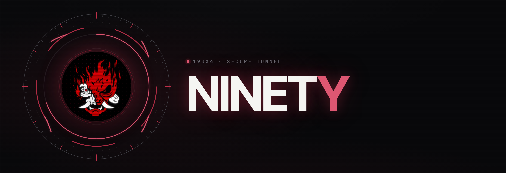
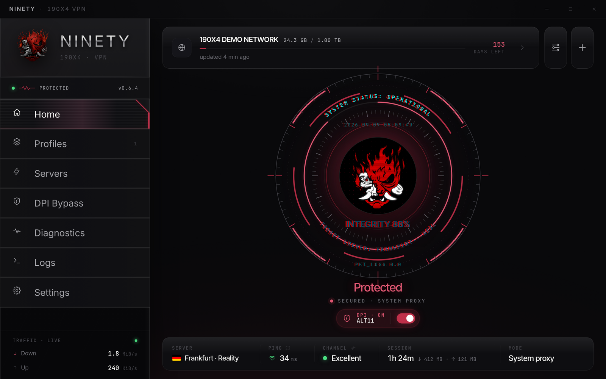
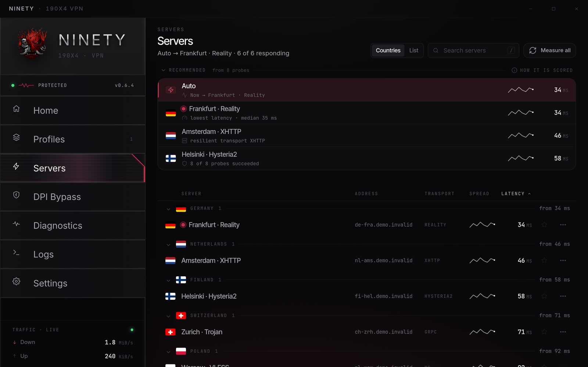
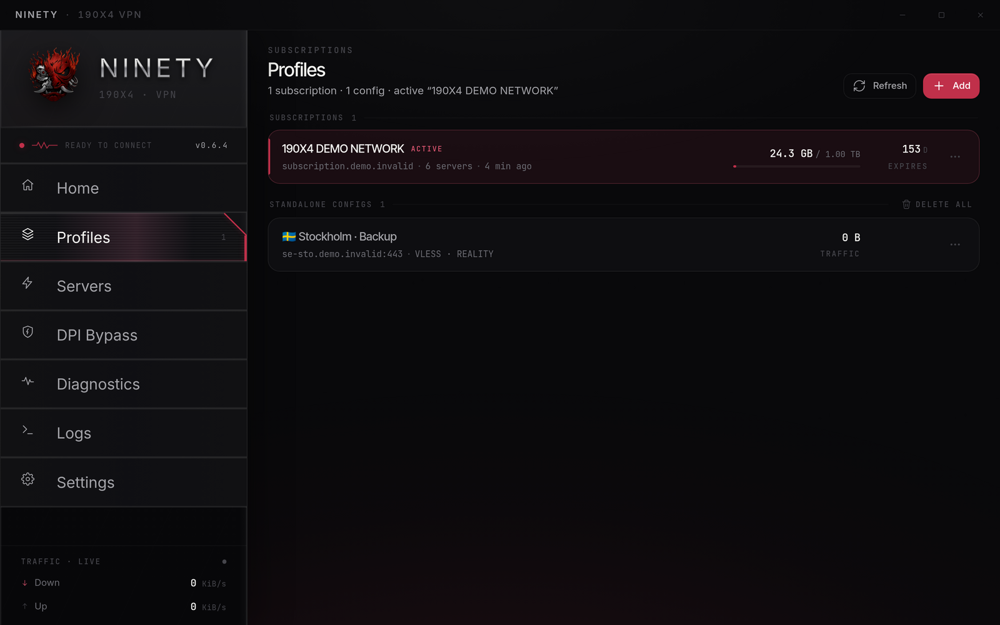
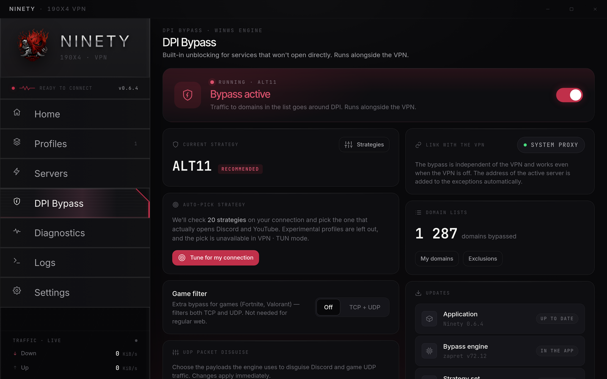
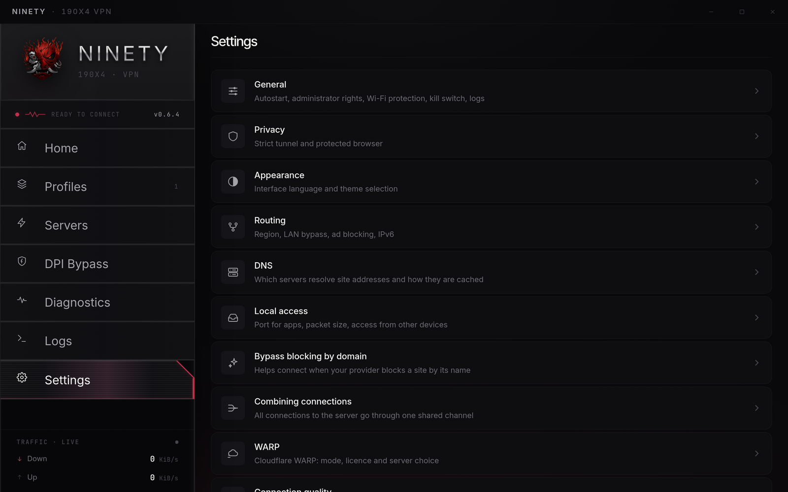
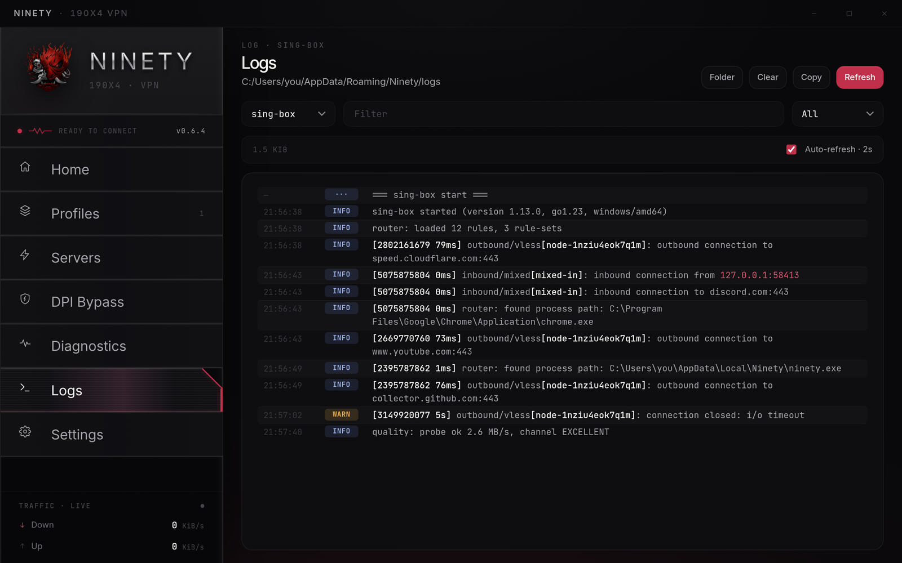
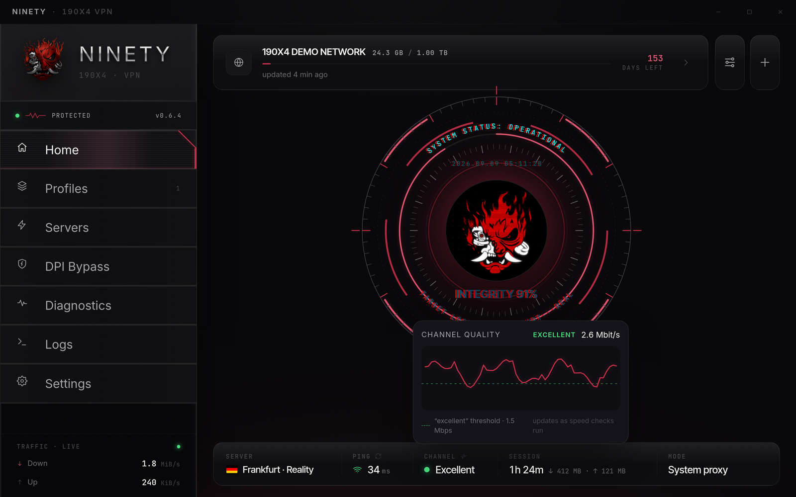

<div align="center">



[](https://github.com/pathetixx/190x4-Ninety/releases)
[](https://github.com/pathetixx/190x4-Ninety/actions)
[](#installation)
[](./LICENSE)

# Ninety

**A Windows networking client built with Tauri 2 and Rust. It brings sing-box, WARP, routing rules and connection diagnostics into one desktop app.**

[Website](https://pathetixx.github.io/190x4-Ninety/) · [Download](https://github.com/pathetixx/190x4-Ninety/releases) · [Русский](./README.ru.md) · **English** · [Changelog](./CHANGELOG.md) · [Security](./SECURITY.md) · [Code signing policy](./CODE_SIGNING_POLICY.md)

</div>

---



## Why Ninety?

Ninety is a native Windows client for the sing-box ecosystem, built with Tauri 2 and Rust. It handles subscriptions, individual profiles, WARP, TUN mode, routing rules, DPI compatibility tools, logs and tray controls from one interface.

Many networking clients stop after generating a `config.json` and showing a green “Connected” label. Ninety keeps track of what is actually happening. It starts and stops helper processes cleanly, restores Windows proxy settings, shows the node that was really selected, removes temporary configs and protects sensitive local data where Windows allows it.

When something breaks, you get diagnostics instead of guesswork.

> Ninety is a networking client, not an anonymity guarantee. Your privacy still depends on the server, provider, configuration and operating-system environment you use.

## Highlights

| Area | What Ninety does |
| --- | --- |
| **Connection modes** | Local proxy, Windows system proxy and full **VPN · TUN** mode. UAC appears only when TUN actually needs elevation; Ninety can also start elevated at login. |
| **Sources** | Imports subscription URLs, individual proxy links and TrustTunnel `.toml` endpoints. Clipboard import is built in, while deep links remain optional. |
| **Node control** | Server grid with country flags, live delay checks, automatic selection, tray switching and tracking of the node currently used by the connection. |
| **Protocols** | VLESS, VMess, Trojan, Shadowsocks, Hysteria2, TUIC, NaiveProxy, TrustTunnel and WARP/WireGuard. |
| **Bridges** | XHTTP runs through xray-core. NaiveProxy and TrustTunnel use local SOCKS sidecars, with sing-box remaining the central router. |
| **Routing** | LAN bypass, regional routing, custom rules for domains, IP addresses and processes, plus ad, malware and phishing rule sets. Active connections can be inspected from the app. |
| **Quality engine** | Measures real throughput instead of treating ping as the whole story. It can re-test the channel, change nodes, apply masking, rescan WARP or recommend reconnecting. |
| **DPI tools** | A separate section for DPI compatibility tools, strategy and list updates, driver cleanup and automatic exclusions for VPN node addresses. |
| **Privacy** | No ads or bundled analytics. Logs use conservative defaults, WARP state and backups are encrypted with Windows DPAPI where supported, and runtime configs are removed after use. |
| **Desktop UX** | Tray controls, in-app updates, session restore after an update, themes, onboarding, 15 languages and RTL layouts for فارسی / العربية. |

## Screenshots

| Nodes | Profiles |
|------|---------|
|  |  |
| **DPI tools** | **Settings** |
|  |  |
| **Logs** | **Channel quality** |
|  |  |

## Supported protocols and transports

**Protocols:** VLESS · VMess · Trojan · Shadowsocks · Hysteria2 · TUIC · NaiveProxy · TrustTunnel · WARP/WireGuard

**Transports and options:** Reality · TLS with uTLS fingerprints · XHTTP · WebSocket · gRPC · HTTP/2 · TCP · TLS fragmentation · padding · mixed-case SNI · mux

NaiveProxy and TrustTunnel run through their own local clients and expose SOCKS bridges to sing-box. XHTTP uses xray-core when necessary. In the UI, they still behave like regular profiles with one source and one connection state.

## Installation

Grab the latest installer from [**Releases**](https://github.com/pathetixx/190x4-Ninety/releases):

- `.exe` — NSIS installer.
- `.msi` — MSI package.

Requirements: **Windows 10 / 11 x64**.

Updates are downloaded from inside the app. When a VPN connection is already active, Ninety can check for updates and download them through the tunnel.

## Quick start

1. Open Ninety and press **+**.
2. Paste a subscription URL or an individual config link such as `vless://`, `vmess://`, `trojan://`, `hysteria2://`, `tuic://`, `naive+https://` or `tt://`.
3. Choose a connection mode:
   - **System proxy** — the default option. It does not require administrator rights and works with browsers and many desktop applications.
   - **Proxy** — starts a local SOCKS/HTTP proxy on `127.0.0.1`. Applications must be configured manually.
   - **VPN · TUN** — sends system traffic through the tunnel and requires elevation.
4. Click the central disc to connect. Click it again to disconnect.

If the connection does not start, open **Logs** first. The log screen shows startup, bridge and routing errors without making you search through application folders.

## Documentation

For users:

- [Modes](./docs/modes.md) — Proxy, System proxy, VPN · TUN, WARP-only mode, DPI tools and the kill switch.
- [Troubleshooting](./docs/troubleshooting.md) — checks you can run, logs worth collecting and information that should never be posted publicly.
- [Privacy](./docs/privacy.md) — local data, sensitive fields, logs, WARP state and known limitations.
- [Routing](./docs/routing.md) — LAN bypass, regional rules, custom routing, DNS and the connection monitor.

About the project:

- [Architecture](./docs/architecture.md) — frontend, Rust backend, sidecars, updater and CI engine injection.
- [Security](./SECURITY.md) — how to report vulnerabilities and other sensitive problems.
- [Code signing policy](./CODE_SIGNING_POLICY.md) — release provenance, signing roles and which artifacts are covered.
- [Contributing](./CONTRIBUTING.md) — what to include in issues and pull requests.

Release development:

- [Releasing](./RELEASING.md) — the release process, annotated tags, draft releases and OTA rules.

## Security and privacy notes

Ninety is open source, but the components it controls can change system-wide networking settings.

- Imported profiles and subscription URLs may contain credentials.
- Remove secrets from logs and screenshots before posting them publicly.
- WARP keys and state backups use Windows DPAPI where the backend supports it.
- TUN mode, DPI tools and the kill switch modify Windows networking. Check the selected settings before enabling them.
- Ninety does not guarantee anonymity.

See [Privacy](./docs/privacy.md) for details on local data handling. Vulnerabilities should be reported according to [SECURITY.md](./SECURITY.md).

## Architecture

Ninety uses a Tauri WebView frontend connected to a Rust backend through Tauri commands and events.

The backend controls sing-box, helper sidecars, WARP/WireGuard state, Windows proxy and TUN settings, the kill switch, updater, logs and runtime cleanup.

The full breakdown is available in [Architecture](./docs/architecture.md).

## Build from source

Requirements:

- Rust stable.
- Node.js 18 or newer.
- MSVC build tools.
- A Windows environment for complete Tauri builds.

```powershell
npm install
npm run tauri dev
npm run tauri build
```

CI downloads the required engines — `sing-box`, `xray-core`, NaiveProxy and TrustTunnel — along with `wintun.dll`. The setup is defined in [`.github/workflows/build.yml`](./.github/workflows/build.yml).

For day-to-day development checks:

```powershell
npm run lint
npm test
```

Full Rust and Tauri checks are best left to the Windows CI pipeline unless your local Windows environment already has the required toolchain and dependencies.

## Repository map

```text
src/                  Frontend: screens, styles, i18n, config builder
src-tauri/src/        Rust backend commands and Windows integration
src-tauri/dpi/        DPI strategies, lists and bundled runtime resources
docs/                 Screenshots and project images
site/                 GitHub Pages website
tests/                JavaScript unit tests
.github/workflows/    Build, checks and release automation
```

## Contributing

Bug reports, reproducible test cases, documentation fixes and focused pull requests are welcome. Read [CONTRIBUTING.md](./CONTRIBUTING.md) before opening a PR.

Never include private subscription URLs, access tokens, UUIDs, private keys or complete exported configs in a public connection bug report.

## Support the project

Ninety is built and maintained in spare time. If it saves you some hassle and you would like to support further development:

**TON**

```text
UQC21op6_5Qgsw0i7TQvh12XBex9I5bqmPeMNuJ20INdjtg7
```

**USDT · TRC20**

```text
TGbdvr1gSYgQciFNRjwdmAmCbNLjK9wgJR
```

Thank you 🖤

## License

[MIT](./LICENSE)