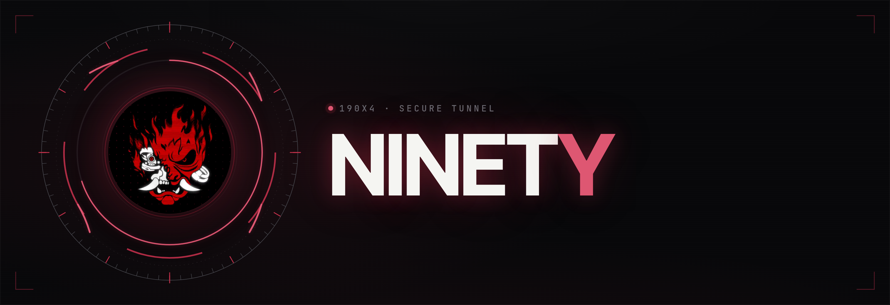
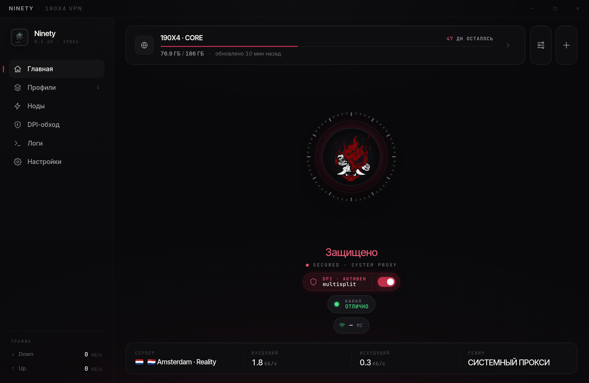
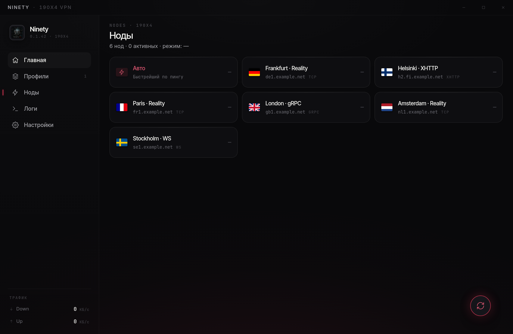
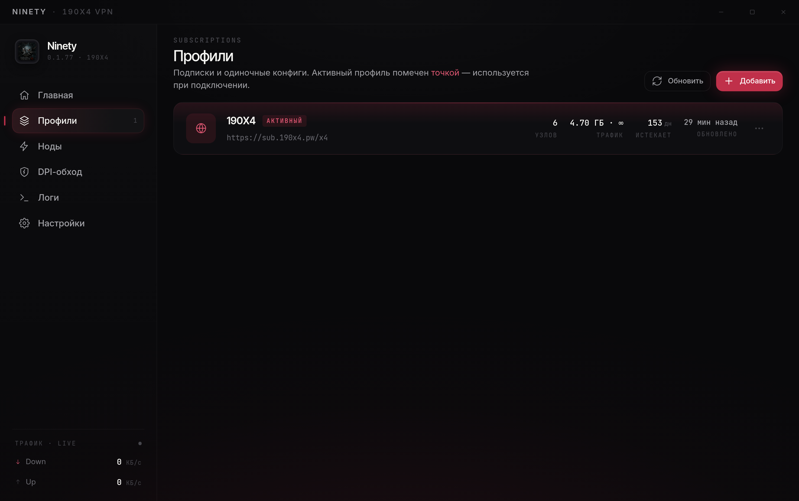
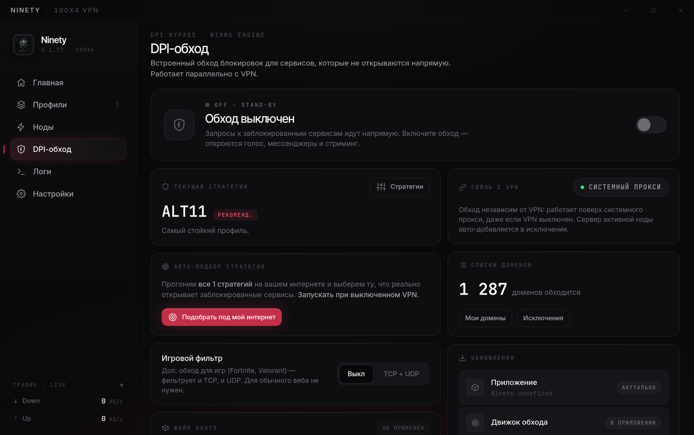
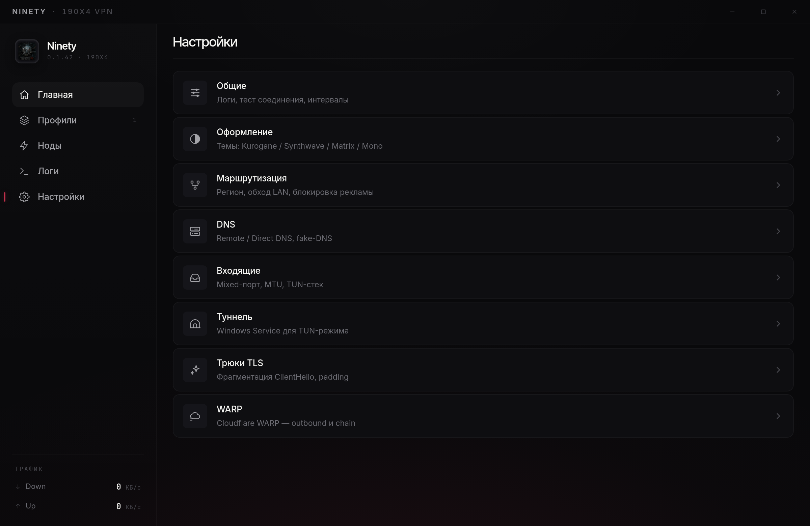
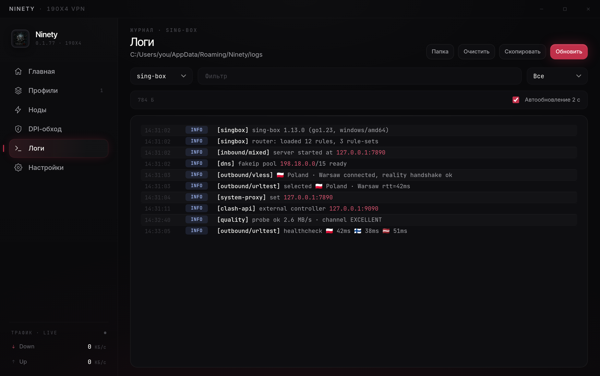
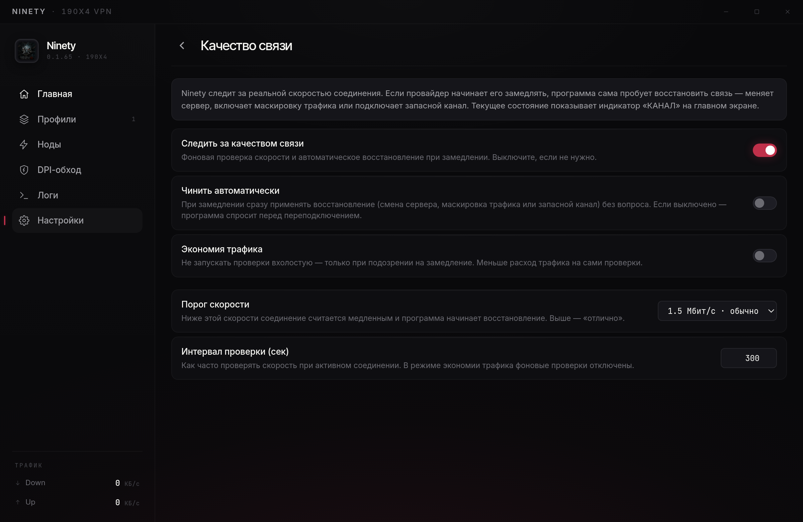

<div align="center">



[](https://github.com/pathetixx/190x4-Ninety/releases)
[](https://github.com/pathetixx/190x4-Ninety/actions)
[](#установка)
[](./LICENSE)

**Нативный VPN-клиент под Windows.**

**Русский** · [English](./README.md)

</div>

---



## Что такое Ninety?

Ninety — нативный VPN-клиент для Windows на базе универсального прокси-ядра sing-box. Умеет многое: авто-выбор быстрейшей ноды, режим TUN на весь трафик системы, подписки и удалённые профили, обход блокировок и маршрутизацию по регионам. С поддержкой широкого набора протоколов (VLESS, VMess, Trojan, Hysteria2, TUIC, NaiveProxy, TrustTunnel и др.), без рекламы и с открытым исходным кодом — это безопасный и приватный доступ к свободному интернету.

## Возможности

- **Подписки и одиночные конфиги** — импорт по URL, из буфера или ссылкой `ninety://`. Авто-обновление по интервалу подписки, QR-экспорт.
- **Выбор ноды** — сетка серверов с флагами и живым пингом; режим **Авто** держит соединение на быстрейшей ноде и переключается сам при росте задержки или таймауте.
- **Контроль качества связи** — следит за реальной скоростью соединения и, если провайдер начинает его замедлять, сам восстанавливает: меняет сервер, включает маскировку трафика или подключает запасной канал. Текущее состояние показывает индикатор на главном экране, тонкая настройка — в разделе «Качество связи».
- **Три режима подключения** — прокси, системный прокси (без прав администратора) и **TUN** (весь трафик системы): включение запрашивает UAC один раз, а опция «всегда от администратора» убирает и его.
- **Обход блокировок** — фрагментация TLS ClientHello (по TLS-записям или TCP-сегментам) помогает поднять туннель, когда провайдер душит handshake по SNI; плюс встроенный DPI-обход для разблокировки сервисов.
- **Маршрутизация** — обход локальной сети, правила по региону (трафик внутрь страны идёт напрямую), блокировка рекламы и трекеров на уровне DNS и роутинга.
- **WARP** — встроенная регистрация, выбор endpoint'а со сканером и маскировкой трафика; работает как самостоятельный выход или как звено в цепочке.
- **Тонкая настройка** — DNS (remote/direct, fake-DNS), MTU и стек TUN, трюки TLS (фрагментация, padding, mixed-case SNI), тест соединения и интервалы.
- **Автозапуск при входе в систему**, сворачивание в трей, автоматические обновления через GitHub Releases.
- **6 тем** — Kurogane, Cyan, Synthwave, Matrix, Command Center, Mono. Весь интерфейс на CSS-переменных, акцент темы подхватывают и окна-порталы, и кибер-HUD на главном экране.
- **15 языков** — интерфейс на 15 языках, переключение в Настройках → Оформление без перезапуска; для فارسی и العربية — вёрстка справа налево (RTL).

## Протоколы и транспорты

VLESS · VMess · Trojan · Shadowsocks · Hysteria2 · TUIC · NaiveProxy · TrustTunnel
Reality · TLS (uTLS-отпечатки) · XHTTP · WebSocket · gRPC · HTTP/2 · TCP

NaiveProxy и TrustTunnel обслуживаются собственными клиентами через локальный
SOCKS-мост (как XHTTP), независимо от выбранного режима подключения.

## Интерфейс

Главный экран — кибер-HUD вокруг живой маски: статус канала, пинг, целостность
соединения и сервер, на который заведён туннель. Остальные разделы:

| Ноды | Профили |
|------|---------|
|  |  |
| **DPI-обход** | **Настройки** |
|  |  |
| **Логи** | **Качество канала** |
|  |  |

## Установка

Скачайте установщик из [**Releases**](https://github.com/pathetixx/190x4-Ninety/releases) — `.msi` или `.exe` (NSIS).
Обновления приходят внутри приложения и ставятся в один клик.

Требования: Windows 10 / 11 (x64).

## Быстрый старт

1. **Добавьте источник.** Кнопка **«+»** вверху — вставьте ссылку на подписку (`https://…`) или одиночный конфиг `vless://` / `vmess://` / `trojan://` / `hysteria2://` / `tuic://` / `naive+https://…` / `tt://…` из буфера. Для TrustTunnel можно также импортировать endpoint-`.toml` файлом (плитка **«Файл .toml»**). Подписка сама подтянет список серверов и будет обновляться по своему интервалу.
2. **Выберите режим** (переключатель на главном экране):
   - **Системный прокси** — по умолчанию, без прав администратора. Подходит для браузера и большинства приложений.
   - **Прокси** — локальный SOCKS/HTTP на `127.0.0.1`; приложения направляете в него сами.
   - **VPN · TUN** — весь трафик системы идёт в туннель. При включении один раз запросит UAC.
3. **Подключитесь** — клик по большому диску в центре главного экрана. Повторный клик отключает.
4. **Тонкая настройка (по желанию):**
   - На вкладке **Ноды** выберите сервер вручную или оставьте **Авто** — клиент сам держит соединение на быстрейшей ноде и переключается при росте задержки.
   - Включите **DPI-обход**, если отдельный сервис недоступен даже с работающим VPN.
   - Включите **фрагментацию TLS**, если туннель вообще не поднимается (см. ниже).

**Не подключается?**
- Обновите подписку (меню профиля → обновить) — серверы могли смениться.
- Смените ноду или переключитесь на **Авто**.
- Включите **фрагментацию ClientHello** (Настройки → Трюки TLS) — часто помогает, когда провайдер режет рукопожатие.
- Откройте **Логи** — там видно, на каком этапе обрывается соединение.

## Обход блокировок

Когда провайдер мешает соединению, в Ninety есть два независимых механизма — их можно использовать вместе.

**Фрагментация TLS ClientHello.** Некоторые провайдеры распознают и режут трафик уже на этапе TLS-рукопожатия, считывая имя сервера (SNI) из первого пакета — ClientHello. Ninety дробит этот пакет на части, чтобы фильтр не собрал SNI целиком, и туннель поднимается. Доступны два способа дробления — по TLS-записям (рекомендуется) или по TCP-сегментам, — плюс padding и mixed-case SNI. Включается в **Настройках → Трюки TLS**.

**DPI-обход.** Отдельный встроенный движок для сервисов, которые провайдер блокирует на уровне DPI даже при работающем VPN (например, голосовые звонки в мессенджерах или отдельные сайты). Управляется в разделе **DPI-обход**: включается одной кнопкой, стратегию можно выбрать вручную или запустить **авто-подбор** — клиент сам переберёт варианты и оставит рабочий под вашего провайдера. Списки доменов и исключений редактируются прямо в приложении, а адреса ваших VPN-нод автоматически попадают в исключения, чтобы обход не задевал сам туннель. В полном TUN-режиме обход не нужен (весь трафик и так в туннеле) и ставится на паузу автоматически. Отдельным переключателем драйвер обхода можно загрузить под нейтральным именем (вместо стандартного) — на функционал это не влияет.

## Сборка из исходников

Нужны Rust (stable), Node ≥ 18 и MSVC build tools.

```powershell
npm install
npm run tauri dev     # окно в режиме разработки
npm run tauri build   # релизная сборка → .msi / .exe
```

Движки (sing-box, xray-core, клиенты NaiveProxy и TrustTunnel) и `wintun.dll` подтягиваются на этапе сборки в CI и не хранятся в репозитории — см. [`.github/workflows/build.yml`](./.github/workflows/build.yml).

## Архитектура

- **Интерфейс** — Tauri 2 (Rust + WebView2), фронтенд на vanilla HTML/CSS/JS без фреймворков и сборщиков.
- **Движок** — sing-box запускается дочерним процессом; транспорт XHTTP обслуживается ядром xray-core, а протоколы NaiveProxy и TrustTunnel — их собственными клиентами; все они подключаются к sing-box через локальный socks-мост.
- **TUN** — sing-box поднимает TUN-интерфейс дочерним процессом приложения, запущенного с правами администратора; UAC запрашивается один раз при включении (опция «всегда от администратора» убирает и его). Управляющий API ядра закрыт секретом и слушает только loopback.
- **Подписки и настройки** — в `localStorage`, конфиг для движка собирается на лету под текущий режим и ноду.

## Поддержать

Проект развивается на энтузиазме. Если Ninety оказался полезен — можно закинуть на кофе (наведите на адрес и нажмите 📋, чтобы скопировать):

**TON**

```
UQC21op6_5Qgsw0i7TQvh12XBex9I5bqmPeMNuJ20INdjtg7
```

**USDT** · TRC20 (Tron)

```
TGbdvr1gSYgQciFNRjwdmAmCbNLjK9wgJR
```

Спасибо 🖤

## Лицензия

[MIT](./LICENSE)
